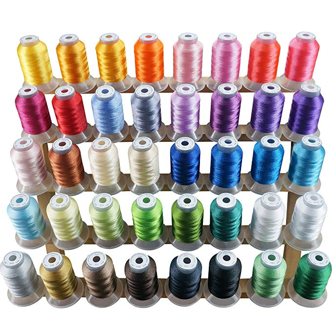

## Brother SE-400 Embroidery Machine

This file contains notes on how ot use the 
Brother SE-400 Embroidery Machine.


## Tools and Supplies

We have tools and supplies in the cabinet.

In terms of fabric, we have various cotton cloths.
In order to embroider,
you will need to place stabilizer behind the cloth.
We have cut-away and tear-away stabilizer.
We recommend you use cut-away.
The stabilizer is pre-cut into 8x8 inch sheets.
To prepare fabric to be embroidered,
place the fabric and the stabilizer back to back,
place in the hoop,
and then stretch the cloth tight enough so there are no wrinkles.

The machine has two threads: bobbin thread and embroidery thread.
Before embroidering, 
make sure the bobbin is preloaded with thread.
Instructions for winding and installing the bobbin
start at page 22 of the [Users Manual](doc/885v31_v32_v33_om04en.pdf).
Remember to use bobbin thread,
which is heavier weight than the embroidery thread.
We have extra bobbins,
so if you change the thread to wind bobbins,
you may want to wind a bunch of them.

For embroidering, we have have 40 weight polyester thread in 
a variety of colors.



Instructions for threading the upper thread are at page 31 of the manual.

While embroidering, you may bend or break a needle.
We have a stash of extra needles.
Typically you would use a Schmetz 75/11 embroidery needle.
If you need to replace a needle,
following the instructions at page 39 of the manual.

## Embroidering a Design

Prepare a PES file using with the design you want to embroider.
To start, embroider an existing pattern.
The directory [pattern](patterns) contains an acorn pattern.
If you google _free pes designs_ you will find many different patterns.
For your first experiment, choose a simple pattern 
with a single thread color.

Next set up the machine for embroidery.
The embroidery machine has the embroidery unit and foot installed.
The instructions for using the machine embroidery
begin on page 117 of the manual.

Here a short 
[video](https://www.youtube.com/watch?v=CNbSRyW7Ai0)
that shows how to use the machine.
Brother also has a DVD of 
[instructional videos](https://www.youtube.com/watch?v=-G-EFea7EWY&list=PLa4UjzMl4KKt9Q5CMrMJtOtmhK8rona0T)
for the machine.

To summarize the steps:

First, move the embroidery foot to the up position.

Second, pick a spool of thread and put it in the spool holder.
Thread the upper thread through mechanisms including the foot.
Cut it to the proper length.
Then use the auto-threader to thread the needle.
Consult the manual for pictures and details on how to do this.

Third, place your hoop with fabric and stabilizer into the embrodery sled,
and latch into position.

Next, transfer a pattern from your laptop to the embroidery machine.
Plug in the USB cable into your laptop
and turn on the machine.
The brother machine should mount itself as a usb flash drive.
On my Mac, it shows up as _NO_NAME_.
Copy the PES file into the volume.

Next select the USB icon on the touch screen.

Finally, lower the foot and push the start button.
The machine should begin to embroider!

## Designing Patterns

In class, I showed the following example program.
This program generates a pattern of running stitches
with different stitch lengths.

```
import pyembroidery as emb
import pyembroidery.EmbThreadPec  as EmbThread

def straight(pattern, y, length):
    pattern.add_stitch_absolute(emb.JUMP,100,y)
    for x in range(100,900,length):
        pattern.add_stitch_absolute(emb.STITCH, x,y)
    if x != 900:
        pattern.add_stitch_absolute(emb.STITCH, 900,y)
    pattern.add_command(emb.STOP)


def rows():
    pattern = emb.EmbPattern()
    pattern.add_thread( EmbThread.get_thread_set()[1] )
    for y in range(100,1000,100):
        straight(pattern, y, 10+y//20)
    pattern.add_command(emb.END)
    return pattern

def test_straight():
    pattern = rows()
    emb.write(pattern, "straight.pes")

test_straight()
```
The directory [code](code) contains this program,
and other programs that were shown during class.

To run this program, you need to install `pyembroidery`,
which is available in the following 
[repo](https://github.com/EmbroidePy/pyembroidery).

The [code directory](code) 
also contains a python program that created a simple `SVG` file, `gc.py`.
One convenient way to convert SVG files to PES files is to use 
[inkstitch](inkstitch.org).
Inkstitch in an [inkscape](inkscape.org) extension.
You will need to go to these web sites 
and download and install this software.

You can also any drawing program (e.g. Illustrator)
to create a design.
Just save it as an SVG file, and read it into Inkscape.
You can also create designs in Inkscape.

## Manuals

[Brother SE-400](https://www.brother-usa.com/products/SE400)

[Quick Reference Guide](doc/885v31_v33_qg01_usenes.pdf)

[Users Manual](doc/885v31_v32_v33_om04en.pdf)

## File formats

[PES/PEC](https://github.com/frno7/libpes/wiki/PES-format)

[PES](https://github.com/frno7/libpes/wiki/PES-section)

[PEC](https://github.com/frno7/libpes/wiki/PEC-section)

[More PEC](https://edutechwiki.unige.ch/en/Embroidery_format_PEC)

[DST]()

[File viewer](https://backface.github.io/html5-embroidery/)

