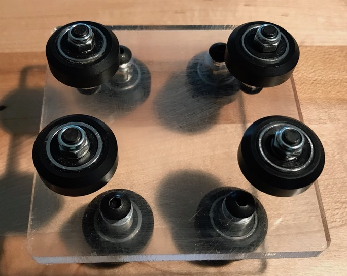
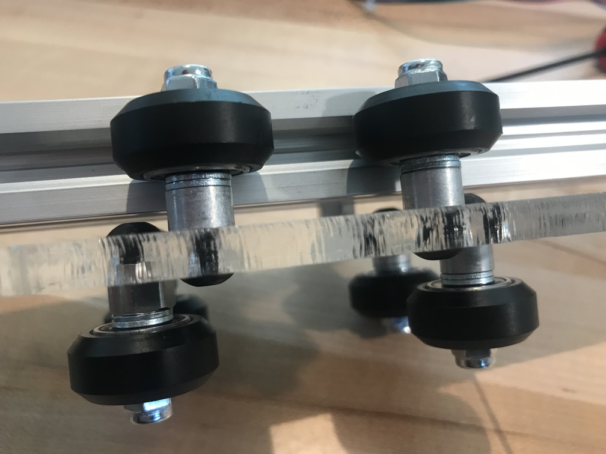
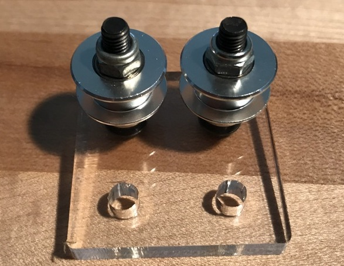
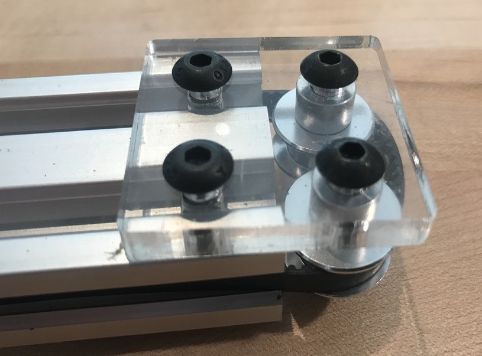
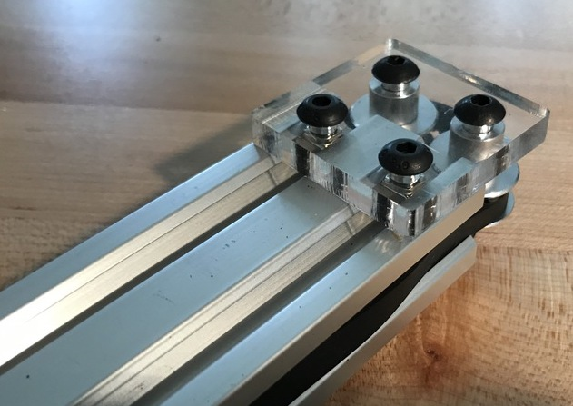
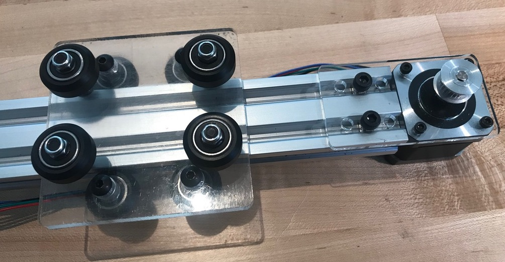
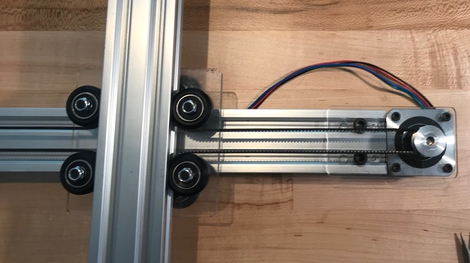
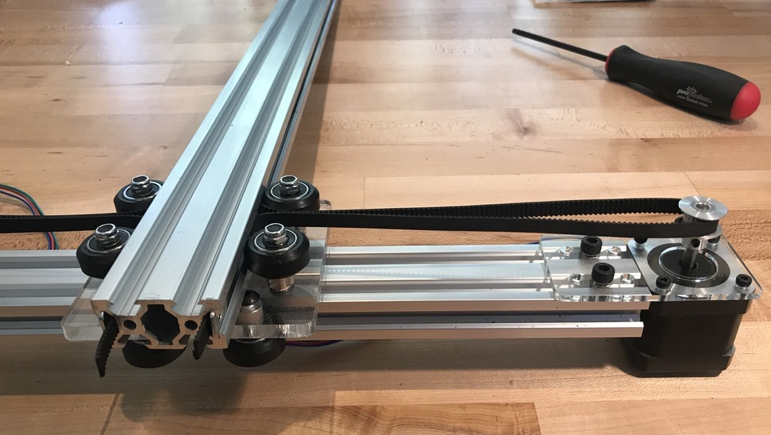
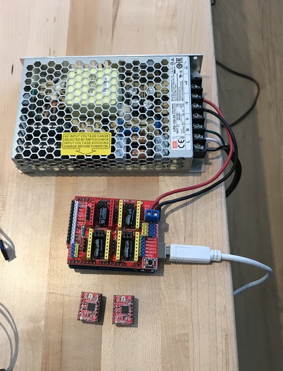

## Goals

This assignment is to build a working t-bot plotter.

1. Learn how to work with 2020 v-slot aluminum extrusion
2. Understand how to control bipolar stepper motors
3. Learn how to compile, install, and run GRBL
4. Plot a drawing

## Kit

Picture of kit

BOM
- 2 500mm 2040 v-slot
- 8 solid v-wheel kits (precision spacer and nylock nut)
- 4 eccentric spacers
- 6 spacers 1/4"
- 2.133m 6mm wide GT2 belt
- 2 GT2 smooth pulley
- 2 GT2 timing pulleys, 20t
- 1 arduino uno R3
- 1 stepper motor driver shield	
- 2 stepper motor driver
- 2 NEMA-17 stepper motors
- 1 IEC power cord
- 1 Meanwell LRS-150-24 24V power supply
- 2 thin M5 t-nuts
- 2 M5 nylock nuts
- 6 thick M5 t-nut
- 6 M5x8mm BHCS	
- 10 M5x30mm BHCS
- 4 M3x10mm BHCS 
- 2 Omron snap-action switches
- 1 SG90 9g micro servo

## Mechanical

### Assembling center plate

Components
- 1 custom laser cut plate
- 8 Openbuilds Solid v-wheel kits
- 16 additional spacers - 2 1mm washers per wheel

*WARNING Removing paper protection may be difficult$

### Stepper motor and mount

Components
- 2 custom laser plates
- 2 NEMA17 stepper motors
- 8 M3 x 10mm BHCS 
- 4 M5 x 10mm BHCS + 4 M5 t-nuts
- 2 GT2 20t timing pulleys

### Assembling idler pulley

Components
- 1 custom laser plate
- 2 smooth pulleys with bearings
- 2 1/4 spacers
- 2 M5 x 30mm BHCS + 2 M5 nuts
- 2 M5 x 10mm BHCS + 2 M5 t-nuts

### Assembling tbot

Components
- 2040 with idler pulleys
- 2040 with 2 stepper motor mounts
- center plate assembly
- 2.133m GT2 timing belt

Assembly
- slide center plate onto 2040
- attach idler pulleys to one end of 2040
- position timing belt
- attach stepper motor to one side of extrusion
- slide extrusion with belt through v-wheels on center plate
- loop timing belt through solid v-wheels
- loop timing belt over timing pulleys attached to stepper motors
- tension timing belt with thin t-nuts

## Electrical

### Power supply

Components
- IEC power cord with male plug removed
- Meanwell power supply

Assembly
- slide switch on power supply to 115 VAC position
- attach line, neutral and ground to power supply terminals

### Stepper motor shield and stepper motor drivers

Components
- 1 Arduino UNO
- 1 Stepper motor shield
- 2 A4988 stepper motor driver breakout boards
- 6 plastic jumpers

Assembly
- Install 3 plastic jumpers on MS1, MS2, and MS3
- Attach to arduino uno
- Insert 2 stepper motor drivers (A4988) in X and Y axis

*WARNING make sure the stepper motor drivers are oriented correctly*

*WARNING DO NOT apply power without stepper motors*

## Software

Instructions
- Download arduino development environment
- Download GRBL
- Compile grbl with in CORE-XY mode
- Install grbl.hex using avrdude
- Download GRBL Universal GCODE Sender
- Configure GRBL settings
- Test
