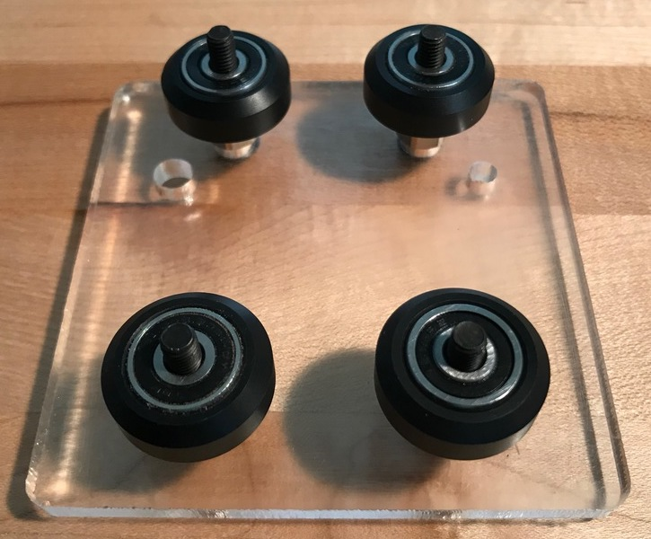
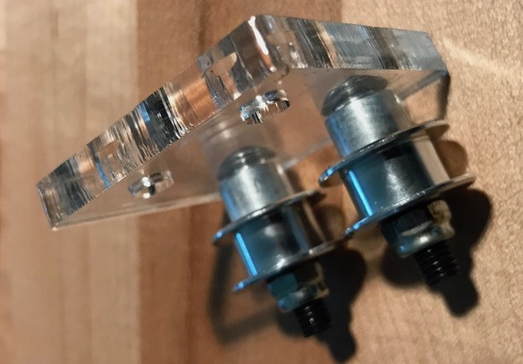
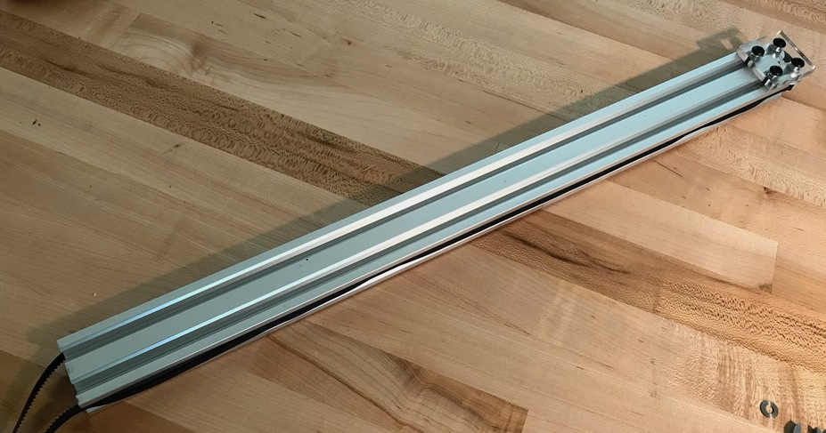
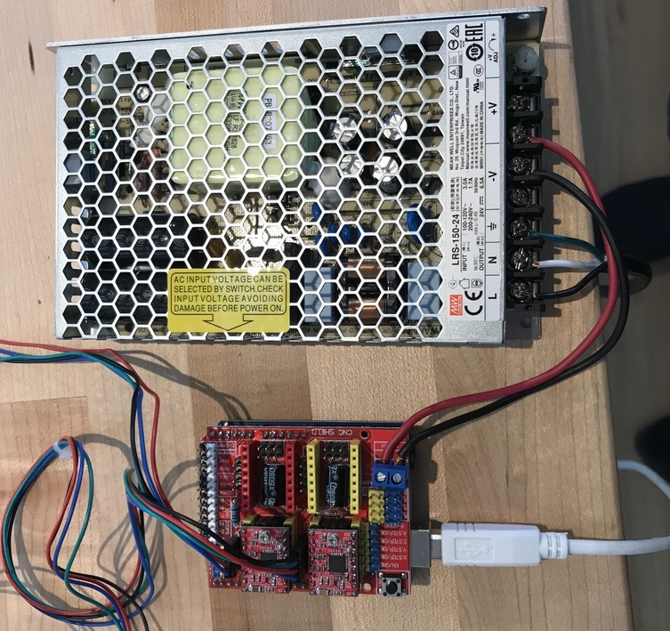

## Goals

This assignment is to build a working t-bot plotter.

1. Learn how to work with 2020 v-slot aluminum extrusion
2. Understand how to control bipolar stepper motors
3. Learn how to compile, install, and run GRBL
4. Plot a drawing

## Kit

Picture of kit

BOM
- 2 500mm 2040 v-slot
- 8 solid v-wheel kits (precision spacer and nylock nut)
- 4 eccentric spacers
- 6 spacers 1/4"
- 2.133m 6mm wide GT2 belt
- 2 GT2 smooth pulley
- 2 GT2 timing pulleys, 20t
- 1 arduino uno R3
- 1 stepper motor driver shield	
- 2 stepper motor driver
- 2 NEMA-17 stepper motors
- 1 IEC power cord
- 1 Meanwell LRS-150-24 24V power supply
- 2 thin M5 t-nuts
- 2 M5 nylock nuts
- 6 thick M5 t-nut
- 6 M5x8mm BHCS	
- 10 M5x30mm BHCS
- 4 M3x10mm BHCS 
- 2 Omron snap-action switches
- 1 SG90 9g micro servo

## Mechanical


### Assembling center plate

[Solid v-wheel kit](https://openbuildspartstore.com/solid-v-wheel-kit/)

[Solid v-wheel kit install video](https://www.youtube.com/watch?v=YtkGiLg2edk)

*CAD drawing an image of a blank plate*





Components
- 1 custom laser cut plate
- 8 solid v-wheel kits (v-wheel, 2 bearings, shims, nylon nut)
- 4 1/4 spacers
- 4 1/4 eccentric spacers
- 24 precision shims

Instructions

1. Start by removing the protective paper from the acrylic plate.

*WARNING Removing paper protection from acrylic may be difficult$

2. Assembly the 8 solid v-wheels. 
This involves inserting 2 bearings into the wheel
with a precision shim in between the bearings.

3. Attach 4 solid v-wheels to one slide of the center plate.
Each v-wheel requires 1 M5x30mm cap screw,
a v-wheel, a 1/4" spacer or eccentric spacer,
2 precision shims, and a nylon nut.
First, insert the 4 machine screws facing up,
then place a spacer and 2 shims on each bolt.
Next add the v-wheel, 
and then place the nylon nut and hand tighten.

Note that as the eccentric spacer is rotated 
the off-axis center hole causes the center of the
spacer to move relative to the center of the plate.o
Orient the eccentric spacer so that the notch is facing outward;
Aligning it in this way creates the maximum distance 
between the opposing wheels.

3. Flip the plate over and attach 4 more solid wheels on the other side.

4. Insert a piece of 2040 through the wheels on the top.
Adjust the eccentric spacers to achieve smooth motion.
The wheels should fit tightly against the 2040 so that there is no play,
yet not so tight that you cannot rotate the wheels by hand.
Repeat this process for the 2040 on the bottom.

### Stepper motor and mount

Components
- 2 custom laser plates for motors
- 2 NEMA17 stepper motors
- 8 M3 x 10mm BHCS 
- 4 M5 x 10mm BHCS 
- 4 M5 t-nuts
- 2 GT2 20t timing pulleys with set screws

Instructions

1. Attach the stepper motor to the motor mounting plate
using 4 M3 set screws.

2. Slide 2 M5 machine screws through the center holes of the mounting plate. 
Attach a t-nut to each screw.

3. Attach the timing pulley to the shaft of the stepper motor.
Note that the shaft has a flat side. 
Align one of the set screws so that it pushes against the flat side.

4. Repeat this process for the second stepper motor.

### Idler pulleys and mount







Components
- 1 custom laser plate for mounting 2 idler pulleys
- 2 smooth pulleys with bearings
- 2 1/4 spacers
- 2 M5 x 30mm BHCS + 2 M5 nuts
- 2 M5 x 10mm BHCS + 2 M5 t-nuts

Instructions

Attach smooth pulleys to the mounting plate.

1 Insert 30mm cap screw through one side,
then on the other side add the spacer, the pulley,
and tighten with a nut.

2 Repeat for the 2nd pulley.

3 Add 2 10mm machine screws and t-nuts.

### Assembling tbot


Components
- 2040 with idler pulleys
- 2040 with 2 stepper motor mounts
- center plate assembly
- 2.133m GT2 timing belt

Assembly
- slide center plate onto 2040
- attach idler pulleys to one end of 2040
- position timing belt
- attach stepper motor to one side of extrusion
- slide extrusion with belt through v-wheels on center plate
- loop timing belt through solid v-wheels
- loop timing belt over timing pulleys attached to stepper motors
- tension timing belt with thin t-nuts

## Electrical

### Power supply



Components
- IEC power cord with male plug removed
- Meanwell power supply

Instructions

1 Slide switch on power supply to 115 VAC position.

2 Attach line, neutral and ground to power supply terminals.

*WARNING Be Careful, these are live wires*

### Stepper motor shield and stepper motor drivers


Components
- 1 Arduino UNO
- 1 Stepper motor shield
- 2 A4988 stepper motor driver breakout boards
- 6 plastic jumpers

Instructions

The stepper motor shield has space for 
4 stepper motor driver chips.
The plotter only uses two of them,
one for X and one for Y.

1 The plastic jumpers are used to configure 
the stepper motor driver for microstepping.
Slide 3 jumpers over the headers MS1, MS2, and MS3.
This configures the driver to 16 microsteps.
Do this for both the X and the Y axes.

2 Insert 2 stepper motor drivers (A4988) in X and Y axis
headers of the stepper motor shielf. 

*WARNING make sure the stepper motor drivers are oriented correctly*

3 Attach the stepper motor driver shield to the Arduino UNO

4 Attach stepper motor cables to the 4 pin headers.

5 Attach 24V DC power cables to the stepper motor shield.
The power supply provides power to the stepper motors.

*WARNING DO NOT apply motor power to the shield unless
the stepper motors as attached to the driver ships.
Providing power when a motor is not attached 
will short-circuit the driver chips*

## Software

Instructions

- Download arduino development environment
<https://www.arduino.cc/en/Main/Software>

- Clone [GRBL 1.1](https://github.com/gnea/grbl).
The [wiki](https://github.com/gnea/grbl/wiki)
has instructions on how to compile using the Arduino IDE.

- Follow the 
[instructions](https://github.com/grbl/grbl/issues/996)
to compile grbl in CORE XY mode.
This involves uncommented the COREXY definition in `config.h`
before compiling.
```
% make
```

- Connect the Arduino UNO to your laptop and install.

```
% make install
```

- Download [Universal GCODE Sender](<https://winder.github.io/ugs_website/>)

- Configure GRBL settings

```
$100=80 
$101=80
$110=2500
$111=2500
$120=200
$121=200
```

- Test by jogging; then try plotting a square.
